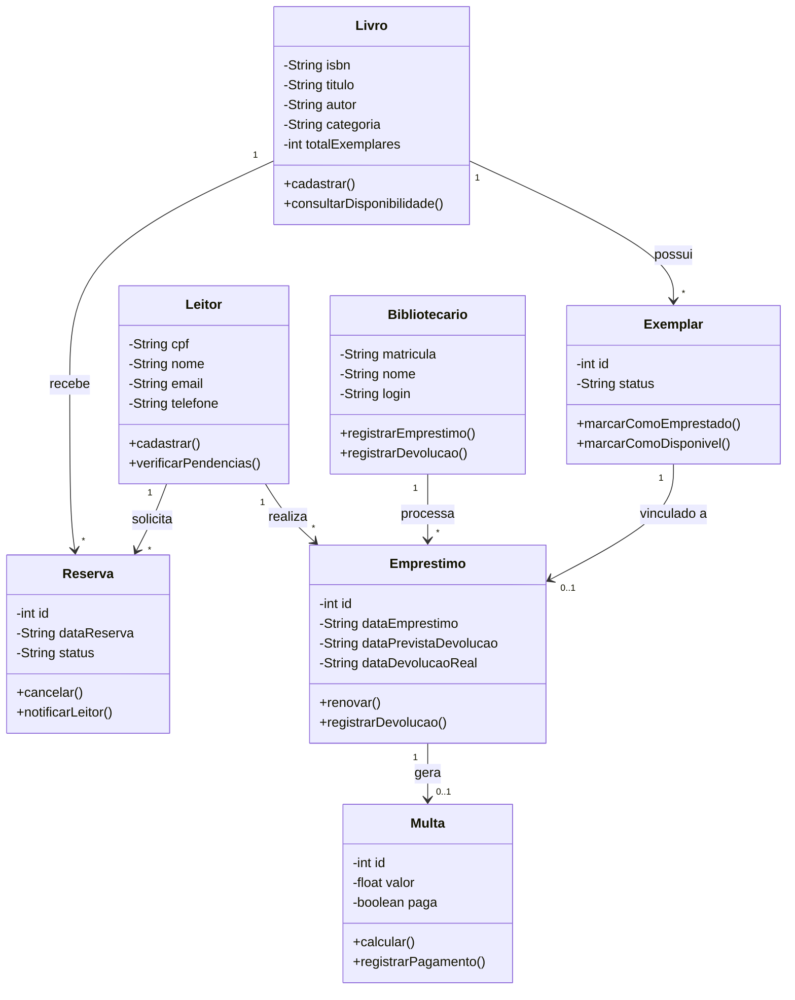
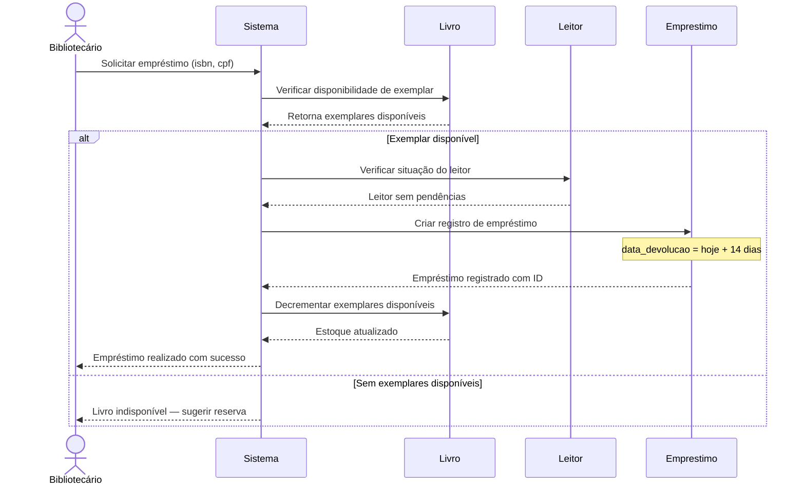
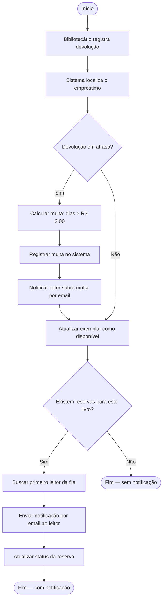

# Modelagem UML — Sistema BiblioTech

---

## a) Diagrama de Classes

---

## b) Diagrama de Sequência — Realizar Empréstimo

---

## c) Diagrama de Atividades — Devolver Livro e Processar Reservas

